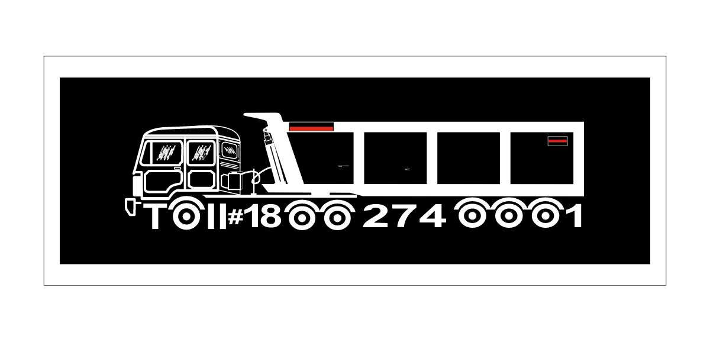

# 🚛 Black Diamond Motors - Concept Redesign



> **Revolutionizing Transport Solutions | High-Performance Next.js Portfolio Project**

This repository contains a **cloned and restructured** version of the Black Diamond Motors website. It is built as a **Personal Portfolio Project** to demonstrate proficiency in modern web development technologies, specifically Next.js 15, TypeScript, and Framer Motion.

---

## 🚀 Live Demo

**Experience the live application here:**
👉 **[https://blackdiamondmotorsresteuctured.vercel.app/](https://blackdiamondmotors.vercel.app/)**

---

## 🛠️ Tech Stack

This project is engineered with a focus on performance, SEO, and cinematic user experience.

* **Framework:** [Next.js 15](https://nextjs.org/) (App Router)
* **Language:** [TypeScript](https://www.typescriptlang.org/)
* **Styling:** [Tailwind CSS](https://tailwindcss.com/)
* **Animations:** [Framer Motion](https://www.framer.com/motion/)
* **Icons:** [Lucide React](https://lucide.dev/)
* **Fonts:** Google Fonts (Oswald & Roboto)
* **Deployment:** Vercel

---

## 🌟 Key Features

* **Premium UI/UX:** A dark-themed, cinematic design reflecting the heavy engineering industry.
* **Product Showcase:** Dedicated pages for Tip Trailers, Rock Bodies, Flatbeds, Side Walls, and Car Carriers with detailed technical specs.
* **Responsive Design:** Fully optimized for Mobiles, Tablets, and Desktops.
* **Interactive Elements:** Native smooth scrolling, animated entry effects, and hover interactions.
* **Service Network:** Detailed sections for After-Sales, Driver Training, Onsite Support, and Consultancy.
* **Contact Integration:** Functional UI for contact forms and Google Maps integration.

---

## 📂 Project Structure

```bash
├── public/              # Static assets (images, icons)
├── src/
│   ├── app/             # Next.js App Router (Pages)
│   │   ├── about/       # Story, Team, Financials
│   │   ├── products/    # Tip Trailer, Rock Body, etc.
│   │   ├── services/    # After Sales, Training, Consultancy
│   │   ├── contact/     # Contact Us Page
│   │   ├── blogs/       # News & Insights
│   │   ├── privacy/     # Legal Pages
│   │   └── layout.tsx   # Root Layout (Navbar, Footer, ScrollToTop)
│   ├── components/      # Reusable UI Components
│   │   └── ui/          # Navbar, Footer, ScrollToTop
│   └── globals.css      # Tailwind & Global Styles
└── README.md            # Project Documentation
```
## ⚡ Getting Started

Follow these steps to run the project locally on your machine.

### 1. Clone the Repository
```bash
git clone [https://github.com/Rahul-kr1623/Black-Diamond-Motors.git](https://github.com/Rahul-kr1623/Black-Diamond-Motors.git)
cd Black-Diamond-Motors
```
### 2. Install Dependencies
```bash
npm install
# or
yarn install
```
### 3. Run Development Server
```bash
npm run dev
```

Open http://localhost:3000 with your browser to see the result.

🤝 Contact Information (Demo)
Black Diamond Motors (Concept Redesign)

📍 Head Office: Industrial Area, Bilaspur (C.G.), India

📞 Phone: +91 98765 43210

📧 Email: contact@example.com

(Note: This is a concept website created for educational/portfolio purposes. The contact details above are placeholders.)

⚖️ License & Usage Rights
© 2025 Rahul Kumar. All Rights Reserved.

This project is a Personal Portfolio Work created for educational and demonstration purposes only.

Codebase: The source code is available for viewing to demonstrate coding skills but cannot be used for commercial purposes without explicit permission.

Brand Assets: The name "Black Diamond Motors" and associated product images are the property of their respective owners. They are used here under Fair Use for non-commercial educational demonstration.

No Cloning: You are not permitted to deploy this code as a competing commercial website.

Developed with ❤️ using Next.js
